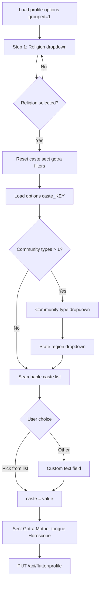

# Flutter — Religion & Caste Step-by-Step (Web jaisa flow + APIs)

**Base URL:** `https://vivahdwar.com`  
**Web reference:** `app/onboarding/page.js` Step 1 + `components/CasteCommunitySelect.js`

---

## Important: Kaun si API step-by-step nahi hai

Web par **har dropdown ke liye alag API call nahi** hoti.

| Web | Flutter (same approach) |
|-----|-------------------------|
| `lib/casteData.js` memory se data | `GET /api/flutter/profile-options` se data |
| Filter **app/client** par | Filter **Flutter app** par |
| Save `POST /api/onboarding` | Save `PUT /api/flutter/profile` |

Sirf **1 load API** + **1 save API**. Beech me saara religion → community type → region → caste logic **client-side** hai.

---

## APIs — sirf yeh 3 use karo

### 1) Options load (screen open par — ek baar)

```
GET /api/flutter/profile-options?grouped=1
Auth: None (public)
```

**Poora response cache** karo (SharedPreferences / memory).

**Alternative (lazy load):**

```
GET /api/flutter/profile-options?category=religion
GET /api/flutter/profile-options?category=caste_Hindu    ← religion select ke baad
GET /api/flutter/profile-options?category=gotra
GET /api/flutter/profile-options?category=motherTongue
GET /api/flutter/profile-options?category=horoscopeSign
GET /api/flutter/profile-options?category=nakshatra
```

Grouped=1 **recommended** — ek call me sab.

---

### 2) Prefill (agar user pehle se data bhara ho)

```
GET /api/flutter/profile
Authorization: Bearer <JWT>
```

Use: `profile.religion`, `profile.caste`, `profile.gotra`, ...

---

### 3) Save religion step

```
PUT /api/flutter/profile
Authorization: Bearer <JWT>
Content-Type: application/json

{
  "religion": "Hindu",
  "caste": "Kanyakubja Brahmin",
  "gotra": "Kashyap",
  "motherTongue": "Hindi",
  "sect": null,
  "horoscopeSign": "Mesh (Aries)",
  "nakshatra": "Ashwini",
  "manglik": "No",
  "kundliMatch": "Not Required"
}
```

---

## Religion → Caste API key map

Jab user religion select kare, is key se list lo:

| User selects religion | `options` key in API |
|----------------------|----------------------|
| Hindu | `caste_Hindu` |
| Muslim | `caste_Muslim` |
| Christian | `caste_Christian` |
| Sikh | `caste_Sikh` |
| Jain | `caste_Jain` |
| Buddhist | `caste_Buddhist` |
| Parsi | `caste_Parsi` |
| Jewish | `caste_Jewish` |
| No Religion | `caste_NoReligion` |
| Other | `caste_Other` |

```dart
String casteKey(String religion) {
  if (religion == 'No Religion') return 'caste_NoReligion';
  return 'caste_$religion';
}
```

---

## Web jaisa step-by-step user flow



---

## Har UI step — data kahan se + kya karna hai

### Step 1 — Religion *

| Item | Source |
|------|--------|
| API | `options.religion` from grouped response |
| Field | Each item: `{ value, label }` — dono same string |
| On change | Clear: `caste`, `sect`, `gotra`, communityType, region, customText |

```json
"religion": [
  { "value": "Hindu", "label": "Hindu", "group": null },
  { "value": "Muslim", "label": "Muslim", "group": null }
]
```

---

### Step 2 — Community type (filter) — optional UI block

**Kab dikhe:** Jab us religion ke **1 se zyada** community types hon.

| Item | How to build (Flutter) |
|------|------------------------|
| Data | `options[caste_KEY]` list ke har item ka `group` parse karo |
| Parse | `"Brahmin — Uttar Pradesh"` → type=`Brahmin`, region=`Uttar Pradesh` |
| Parse | `"Brahmin"` only (Pan India) → type=`Brahmin`, region=null |
| Unique types | Saari entries se unique `type` collect karo (`__OTHER__` skip) |

**On change:** Clear `region`, clear selected `caste`.

---

### Step 3 — State / region (filter)

| Item | Rule |
|------|------|
| Enabled | Sirf jab **Community type** select ho |
| Data | Us type ki entries jahan `group` me ` — ` hai, region part collect karo |
| On change | Clear selected `caste` |

---

### Step 4 — Caste / Community * (searchable list)

| Item | Rule |
|------|------|
| Label | Hindu: "Caste / Community", Muslim: "Community / Biradari", etc. (table below) |
| List | `options[caste_KEY]` filter by selected type + region |
| Search | `label` ya `group` par match (web SearchableSelect jaisa) |
| Group header | Dropdown me `group` string section title |
| Required | **Hindu = required**; baaki optional |
| Last option | `{ value: "__OTHER__", label: "Other — not in list..." }` |

**Save value:** `option.value` (e.g. `"Kanyakubja Brahmin"`) → `profile.caste`

**Labels:**

| Religion | Picker title |
|----------|--------------|
| Hindu | Caste / Community |
| Muslim | Community / Biradari |
| Christian | Denomination / Church |
| Sikh | Community / Sampradaya |
| Jain | Jain Sangh / Community |
| Buddhist | Buddhist Community |
| Parsi | Parsi / Irani Community |
| Jewish | Jewish Community |
| No Religion | Belief / Identity |
| Other | Community / Faith |

---

### Step 5 — Other (custom caste)

| Item | Rule |
|------|------|
| Trigger | User selects `__OTHER__` |
| UI | Text field max 120 chars |
| Save | **Typed text** → `caste` (kabhi `__OTHER__` DB me mat bhejo) |

---

### Step 6 — Sect (conditional)

**API me `sect` category nahi hai** — web `lib/religionData.js` se hardcoded list use karta hai.

Flutter me religion ke hisaab se static list rakho (web same):

| Religion | Show sect? | Example options |
|----------|------------|-----------------|
| Muslim | Yes | Sunni, Shia, Ahmadiyya, Sufi, Ismaili, Bohra, Other |
| Buddhist | Yes | Theravada, Mahayana, Vajrayana / Tibetan, Zen, ... |
| Jain | Yes | Digambar, Shwetambar, Sthanakvasi, Terapanthi, Other |
| Jewish | Yes | Orthodox, Conservative, Reform, ... |
| Sikh | Yes (Amritdhari) | Yes, No, Prefer Amritdhari partner |
| Hindu, Christian, Parsi, ... | No | Hide dropdown |

Save: `profile.sect`

---

### Step 7 — Gotra (Hindu only)

| Item | Source |
|------|--------|
| API | `options.gotra` |
| Show | `religion == 'Hindu'` |

Save: `profile.gotra`

---

### Step 8 — Mother tongue

| Item | Source |
|------|--------|
| API | `options.motherTongue` |
| Show | Always (optional) |

Save: `profile.motherTongue`

---

### Step 9 — Horoscope (Hindu only)

| Field | Source |
|-------|--------|
| Rashi | `options.horoscopeSign` |
| Nakshatra | `options.nakshatra` |
| Manglik | Static: `Yes`, `No`, `Anshik Manglik (Partial)`, `Don't Know` |
| Kundli match | Static: `Must Match`, `Preferred but not mandatory`, `Not Required` |

Defaults: `manglik: "No"`, `kundliMatch: "Not Required"`

Save columns: `horoscopeSign`, `nakshatra`, `manglik`, `kundliMatch`

---

## `group` field parse — core logic (copy-paste ready)

```dart
class ProfileOption {
  final String value;
  final String label;
  final String? group;
  ProfileOption({required this.value, required this.label, this.group});
}

(String type, String? region) parseGroup(String? group) {
  if (group == null || group.isEmpty || group == 'Other') return ('', null);
  const sep = ' — ';
  if (group.contains(sep)) {
    final i = group.indexOf(sep);
    return (group.substring(0, i).trim(), group.substring(i + sep.length).trim());
  }
  return (group.trim(), null); // Pan India
}

List<String> communityTypes(List<ProfileOption> castes) {
  final s = <String>{};
  for (final o in castes) {
    if (o.value == '__OTHER__') continue;
    final (t, _) = parseGroup(o.group);
    if (t.isNotEmpty) s.add(t);
  }
  return s.toList()..sort();
}

List<String> regionsForType(List<ProfileOption> castes, String type) {
  final s = <String>{};
  for (final o in castes) {
    if (o.value == '__OTHER__') continue;
    final (t, r) = parseGroup(o.group);
    if (t == type && r != null && r.isNotEmpty) s.add(r);
  }
  return s.toList()..sort();
}

List<ProfileOption> filterCastes(
  List<ProfileOption> castes, {
  String? type,
  String? region,
  String query = '',
}) {
  final q = query.toLowerCase();
  final out = <ProfileOption>[];
  for (final o in castes) {
    if (o.value == '__OTHER__') { out.add(o); continue; }
    final (t, r) = parseGroup(o.group);
    if (type != null && type.isNotEmpty && t != type) continue;
    if (region != null && region.isNotEmpty && r != region) continue;
    if (q.isNotEmpty &&
        !o.label.toLowerCase().contains(q) &&
        !(o.group ?? '').toLowerCase().contains(q)) continue;
    out.add(o);
  }
  return out;
}
```

---

## Example: Hindu user flow

```
1. GET profile-options?grouped=1  (cached)

2. User picks Religion = "Hindu"
   → castes = options["caste_Hindu"]

3. Community types derived:
   ["Brahmin", "Rajput / Kshatriya", "Yadav / Ahir / Gwala", "Jat", ...]

4. User picks Community type = "Brahmin"
   → regions = ["Uttar Pradesh", "Bihar", "Maharashtra", ...]

5. User picks State = "Uttar Pradesh"
   → filtered list:
      - Kanyakubja Brahmin
      - Saryupareen Brahmin
      - Gaur Brahmin
      ...

6. User selects "Kanyakubja Brahmin"
   → selectedCaste = "Kanyakubja Brahmin"

7. Gotra = "Kashyap" (from options.gotra)
   Mother tongue = "Hindi"

8. PUT /api/flutter/profile
   { "religion": "Hindu", "caste": "Kanyakubja Brahmin", "gotra": "Kashyap", ... }
```

---

## Example: Muslim user flow

```
1. Religion = "Muslim"
   → options["caste_Muslim"]

2. Community type = "Ashraf — Syed / Sheikh / Pathan"
   → region = "Uttar Pradesh"

3. Pick "Syed (UP — Lucknow)"
   → caste = "Syed (UP — Lucknow)"

4. Sect = "Sunni" (static list — not from profile-options)

5. PUT profile
```

---

## API response sample (`caste_Hindu` entries)

```json
{
  "value": "Kanyakubja Brahmin",
  "label": "Kanyakubja Brahmin",
  "group": "Brahmin — Uttar Pradesh",
  "sortOrder": 0
}
```

```json
{
  "value": "Syed",
  "label": "Syed",
  "group": "Ashraf — Syed / Sheikh / Pathan",
  "sortOrder": 120
}
```

`group` me **Pan India** ho to:

```json
{
  "value": "Ansari",
  "label": "Ansari",
  "group": "Ajlaf — Ansari / Julaha / Artisans",
  "sortOrder": 200
}
```
(region null — sirf community type se filter)

---

## Server setup (pehli baar)

Agar `caste_Hindu` empty aaye:

```
POST /api/admin/profile-options/seed
(Admin login required — ek baar production me)
```

Yeh `lib/casteData.js` ki poori religion-wise list DB me daalta hai.

---

## Flutter screen order (recommended)

| # | Widget | API call |
|---|--------|----------|
| 0 | Screen init | `GET profile-options?grouped=1` + `GET profile` |
| 1 | Religion dropdown | `options.religion` |
| 2 | Community type | client filter from `options[caste_KEY]` |
| 3 | State/region | client filter |
| 4 | Caste searchable | client filter + search |
| 5 | Custom text (if Other) | local |
| 6 | Sect | static per religion |
| 7 | Gotra | `options.gotra` if Hindu |
| 8 | Mother tongue | `options.motherTongue` |
| 9 | Horoscope | `options.horoscopeSign`, `nakshatra` + static manglik/kundli |
| 10 | Next / Save | `PUT /api/flutter/profile` |

---

## Validation (web jaisa)

- Religion empty → block Next  
- Hindu + caste empty → block Next  
- `__OTHER__` selected + custom text empty → block  
- Religion change → reset dependent fields  

---

## Files (backend reference)

| File | Role |
|------|------|
| `app/api/flutter/profile-options/route.js` | Flutter options API |
| `lib/casteData.js` | Source tree (Hindu + helpers) |
| `lib/casteDataNonHindu.js` | Muslim, Christian, ... trees |
| `lib/profileOptionsSeed.js` | DB seed from casteData |
| `components/CasteCommunitySelect.js` | Web filter UI logic |
| `app/api/flutter/profile/route.js` | PUT save |
